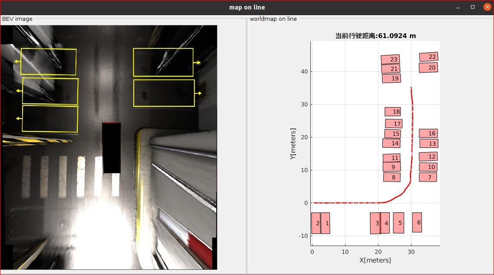
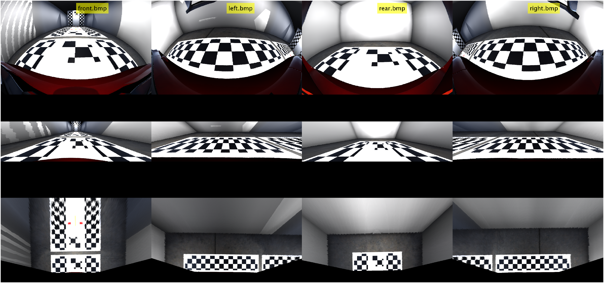
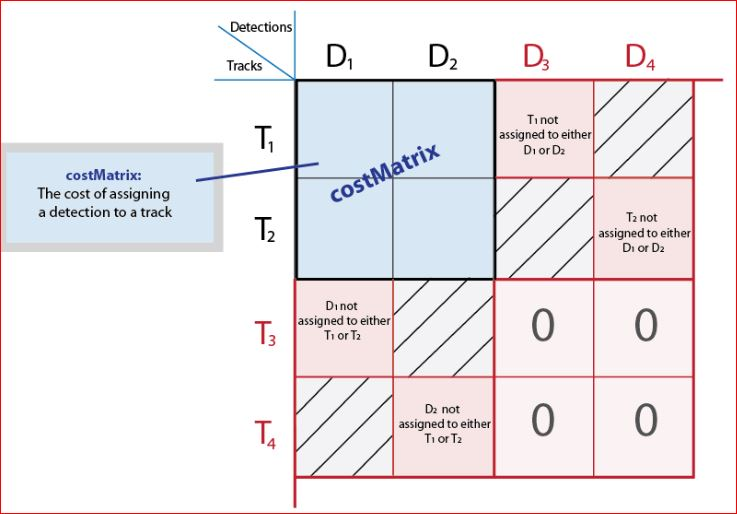
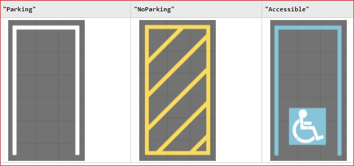
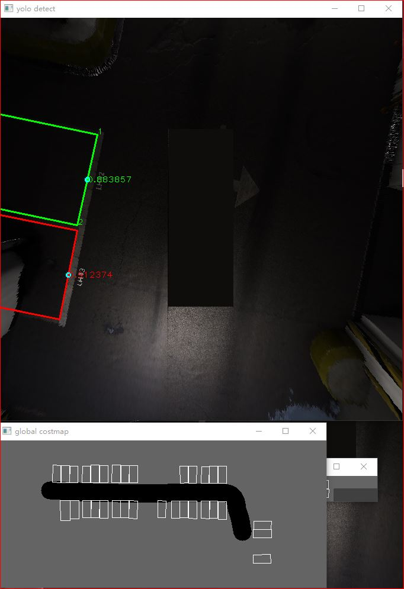
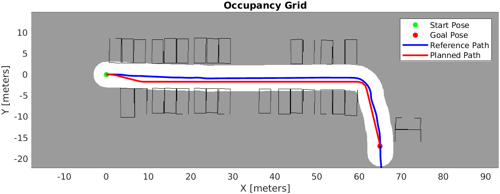

# 基于先验里程计+车位检测实时构建costmap 2D地图及路径规划

## Overview

> 本repo旨在根据**4副鱼眼原始环视图+先验`egoVehicle`里程计($x$,$y$,$\theta$)+俯视图车位检测**，依旧逐步完成多相机标定、图像拼接/融合、BirdEyeView俯视图生成、多目标车位检测跟踪，最终实时构建2D cost map地图和全局路径规划。

<!-- @import "[TOC]" {cmd="toc" depthFrom=1 depthTo=6 orderedList=false} -->

<!-- code_chunk_output -->

- [基于先验里程计+车位检测实时构建costmap 2D地图及路径规划](#基于先验里程计车位检测实时构建costmap-2d地图及路径规划)
  - [Overview](#overview)
  - [Features](#features)
  - [Workflow](#workflow)
    - [1. Fisheye Camera Calibration](#1-fisheye-camera-calibration)
    - [2. Multi-Object Parking Detection And Track](#2-multi-object-parking-detection-and-track)
    - [3. Cost Map](#3-cost-map)
    - [4. Path Planning](#4-path-planning)
  - [C++ implementation](#c-implementation)
  - [Reference](#reference)

<!-- /code_chunk_output -->

## Features

- [x] 支持实时动态任意构建，依旧无需预先指定地图总大小
- [x] 像素地图与物理地图一一对应，查询/定位方便
- [x] 支持多目标车位跟踪关联
- [x] :star:(new)支持任意给定costmap地图和起止2D点坐标，规划一条无碰撞全局路径
- [x] :star:(new)支持地图加载和保存(xml,bin,json等任意格式，优势明显)，非两年前保存的像素地图
- [x] :star:(new)支持地图动态增补
- [x] :star:(new)支持地图多语义标签表达，非之前的二进制(0或者1)模式
- [x] :star:(new)支持全局地图和当前局部costmap地图随时获取
- [x] 高效支持嵌入式C/C++代码生成
- [ ] 支持车道线、导流线、柱子等各类障碍物感知信息的输入
- [ ] 支持3层地下停车场地图设计
- [ ] 支持提供给UI全局地图路径规划接口
- [ ] 支持提供给UI多层地图(全局和局部)接口
- [ ] 支持全局路径在拐弯、跨层、十字路口等描述
- [ ] 支持全局地图处理误差累计修正
- [ ] 支持地图误差实时输出
- [ ] 支持地图分区域/分段
- [ ] 支持泊车后地图自动更新

## Workflow

### 1. Fisheye Camera Calibration

根据车载周围的四副鱼眼畸变图像和里程计等相关数据，可以不用传统的“棋盘标定板”检测每张图像的每个角点的方法标定鱼眼图像，本项目亮点做法是：

- 利用畸变表多项式拟合求解内参和畸变系数
- **仅利用地面一个矩形的物理尺寸计算内外参**

详细实现标定流程文件请参阅[`fisheyeCameraCalibration.m`](./fisheyeCameraCalibration.m)或者[pdf](https://github.com/cuixing158/Visual-Based-Odometry-Estimation/blob/main/fisheyeCameraCalibration.pdf)。

标定大体流程图从上到下如下过程：

Fig. 第1行为原始鱼眼畸变图像,第2行为对应的去畸变图像，第3行为对应的俯视图像

最后计算各自视图相对"front"的转换矩阵，融合拼接全景俯视图像即可。

### 2. Multi-Object Parking Detection And Track

目前是使用深度学习经典的yolo模型在BEV图像下做车位检测，多目标跟踪关联策略输出稳定的车位序号。这个是非常成熟的技术，主要看三点：

1. 跟踪到的车位，即assignments分配情况；

2. 跟踪丢失的车位，即missingTracks；

3. 新进入的车位，即unassignedDetection;

Fig. Cost代价矩阵，每行代表跟踪，每列代表检测

说明如下：对于第1种情况，跟踪与某个检测关联上了，其历史计数应当加1；第2种情况，跟踪丢失，跟踪器不一定删除，但若超过给定阈值，则删除此跟踪；第3种情况，新进入的车位，一般没有与历史跟踪匹配的上，那么新建一个跟踪。

Cost代价矩阵的计算根据自己定义的距离函数进行度量，由于目前是车位跟踪，以车位中心点的世界坐标欧式距离为指标计算即可。**要输出车位costmap地图，无需对跟丢失的车位进行删除，问题其实简化了很多，只需关注要上面第1,3点即可。车位序号即跟踪器序号，可以稳定输出，即使以后走回圈重识别到以前的车位，依旧可以稳定输出车位序号。**

- 车位的正确表达方式

上面说了多目标跟踪器，那么自然就联想到上面一个“检测目标”应该怎么表示，车位应当作为一个单独“类”来进行管理，做到跟踪器与车位无关！比如本项目目前用的是深度模型输出的2个顶点和夹角表示法，其可以转换为我们任何想要的表示方式，最简单直观的是输出4个顶点坐标。

其实，常用的车位类型有很多种，比如下面几种，而我们遇到更多的是封闭式车位和车位线上的独有车位序号，这个应当作为车位这个类型的附加属性管理。车位当然还有其他更多属性，比如宽度，长度，车位线类型等等。

Fig. 车位类型，图源[link](https://ww2.mathworks.cn/help/driving/ref/parkingspace.html?s_tid=doc_ta)

根据问题需要，本Repo使用简化的表示方式，即[$centerX$,$centerY$,$width$,$length$,$\theta$]表示一个车位，只考虑位姿，不考虑其他车位属性。

### 3. Cost Map

由上面几个步骤后，就要建立`Cost Map`地图了，其意义在于为后续的规控提供搜索空间，地图包含了障碍物和`ego vehicle`可行驶区域，以网格占据概率进行表征。要得到一条无碰撞行驶轨迹，适当时候算法会把地图转换成一张二值像素图像，以车辆的最小包围半径进行基本的图像处理操作，比如膨胀，腐蚀等。然后结合全局路径规划器（比如A*,RRT，PRM等等），最终通过地图，构建一条无碰撞的行驶轨迹。

当前我们感知算法内容仅有车位是否占据网格，即只有障碍物和自由空间之分，故简化成了`binaryCostMap`地图。

- 正确的地图构建方式

常规构建`Cost Map`，一般会考虑到停车场大小，像素与物理世界的分辨率，还有考虑到动态扩展地图大小等因素。在程序实践上，一般要预分配一块内存用于保存地图总大小空间(比如[binaryOccupancyMap](https://ww2.mathworks.cn/help/nav/ref/binaryoccupancymap.html)，当然我也可以做到不预分配，动态扩增方式)不预分配总大小，随着地图扩张，按照自适应方向以`padArray`方式逐步扩张边界像素图像达到动态建图目的。

要正确并实时方式构建地图，也要考虑到`ego vehicle`的任意走向和未知的停车场大小，所以前期**不要用像素地图扩张的方式构建，而是以非常自然的世界物理坐标方式表示传递，到真正需要路径规划用到`Cost Map`的时候，最后一步如有必要时直接转换为像素地图。其优势还在于此方法几乎没有任何计算开销和地图内存占用开销！仅仅用到几个坐标系转换矩阵乘法而已！**

以近期的数据为例，其最终实时构建的动态costmap地图如下：

Fig. 左侧为当前帧检测车位，右侧为对应的costmap地图

### 4. Path Planning

这里主要是指地图的全局路径规划，只有在**泊车模式**下才启用。在建图模式下给定的`costmap`地图+起始和终点坐标点，生成一条无碰撞的全局路径，目的用于后续局部路径规划作为参考线。另外关于局部路径规划请参阅郭倩之前的相关工作。

根据年前自己完成的部分`C++`版`costmap`地图工作，结合近期的逐步完善，现在可以得到如下的多语义地图：

Fig. 多语义地图

简单解释如下：如果以像素地图表征`costmap`，那么图像中是以概率网格占据的形式，在[0,1]范围之间，概率越接近1就越代表非freespace区域，越接近0就越代表可行驶区域。

关于一段路径的路径规划示例如下：给定上述`costmap`地图+起始点和终止点坐标分别为`startPose = [0,0,0]`,`goalPose = [65,-17,-pi/2]`，那么通过混合A*算法可以得到如下规划路径。在MATLAB中可视化如下：

Fig. 路径规划

## C++ implementation

C++实现了上面同等部分功能，请移步到我的此[Repo](https://github.com/cuixing158/costmap_pathplan_cpp),欢迎批评指正！

## Reference

1. [Create 360° Bird's-Eye-View Image Around a Vehicle](https://www.mathworks.com/help/driving/ug/create-360-birds-eye-view-image.html)
1. [Automated Parking Valet](https://www.mathworks.com/help/driving/ug/automated-parking-valet.html)
1. [Automated Parking Systems](https://www.mathworks.com/help/driving/automated-parking-systems.html)
